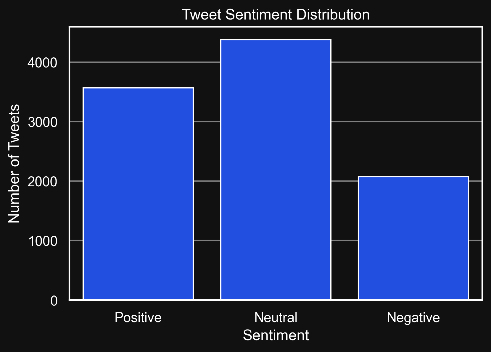
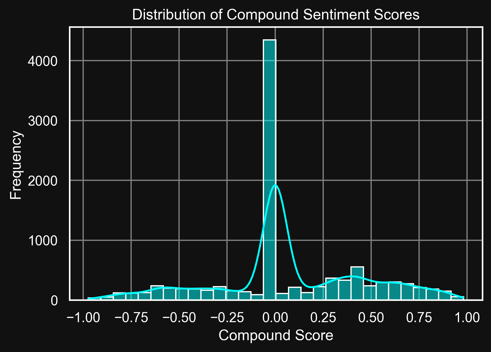
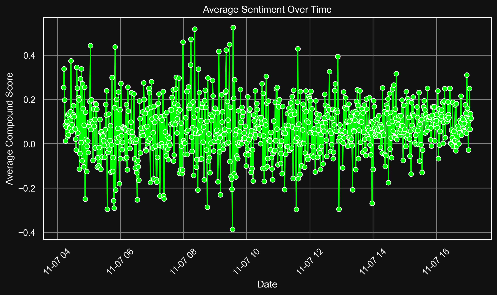

# **Twitter Sentiment Analysis on Stock-related Tweets** 📊

### What this project is about

Instead of trying to predict stock prices (which is super complex), I decided to focus on how people feel about a stock on Twitter — positive, neutral, or negative.
The idea is to understand market sentiment without diving into price prediction.

**Here’s what I did:**

- Collected tweets about a stock (Tesla in this case)

- Cleaned and preprocessed the text

- Analyzed sentiment using Python

- Visualized the results with plots

### **📂 Project Structure**

📁 data/

├── 📁 raw/ # Original/raw tweet files

│ └── tesla_tweets.csv

├── 📁 processed/ # Cleaned & sentiment-labeled files

│ ├── cleaned.csv

│ └── cleaned_sentiment.csv

📁 plots/ # Generated visualizations

├── sentiment_distribution.png

├── compound_scores.png

└── average_sentiment_over_time.png

📁 venv/ # Python virtual environment

📄 data_cleaning.py # Script to clean raw tweets

📄 sentiment_analysis.py # Script to analyze sentiment

📄 visualize_sentiment.py # Script to create plots

📄 README.md # Project documentation

📄 requirements.txt # Python dependencies

### **⚙️ Setup & Installation**

**1. Clone the repo**

 git clone &lt;your-repo-link&gt;
 
 cd &lt;repo-folder&gt;

**2. Create and activate a virtual environment**

  python -m venv venv

### Windows
venv\Scripts\activate
### Mac/Linux
source venv/bin/activate

**Install dependencies**

- pip install -r requirements.txt
  
Dependencies: pandas, matplotlib, seaborn, nltk, textblob, vaderSentiment

# 💻 How to Run

**1️⃣ Clean the raw data**

- python data_cleaning.py

Input: data/raw/tesla_tweets.csv

Output: data/processed/cleaned.csv

**2️⃣ Perform sentiment analysis**

- python sentiment_analysis.py

Input: data/processed/cleaned.csv

Output: data/processed/cleaned_sentiment.csv

**3️⃣ Create visualizations**

- python visualize_sentiment.py

Input: data/processed/cleaned_sentiment.csv

Output: Plots saved in plots/

# 📊 Visualizations

**Sentiment Distribution**
Shows the proportion of positive, neutral, and negative tweets.

**Compound Scores** 
Distribution of Compound Sentiment Scores.

**Sentiment Trends Over Time**
Shows how opinions change over time.

### 🎯 Highlights
- Simple and easy way to analyze stock sentiment

- No need for complex stock price prediction models

- Fully reproducible and easy to extend for other stocks

### **💡 What I Learned**
- How to **collect and preprocess Twitter data** for analysis  
- Techniques for **text cleaning** including removing URLs, mentions, and emojis  
- How to use **sentiment analysis libraries** like VADER and TextBlob  
- Creating **visualizations** to display sentiment distribution and trends  
- Structuring a **Python project** with separate scripts for cleaning, analysis, and plotting  
- Making the project **reproducible and shareable** on GitHub

### Developed by Jovin Ryan Samuel ✨
